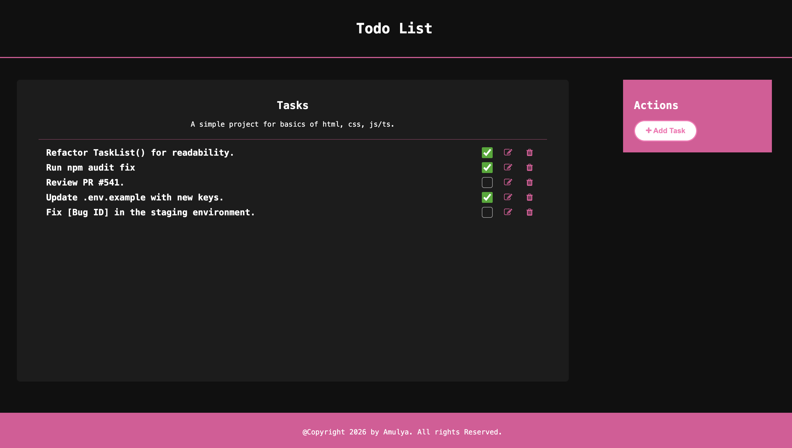
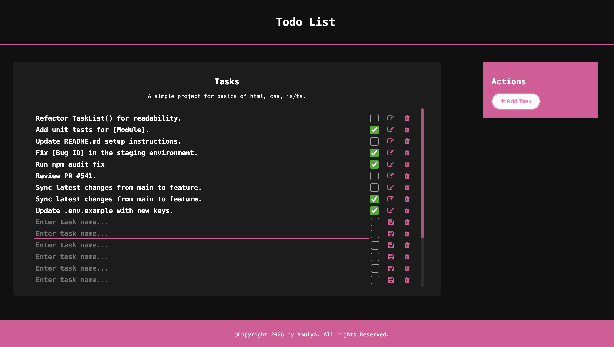
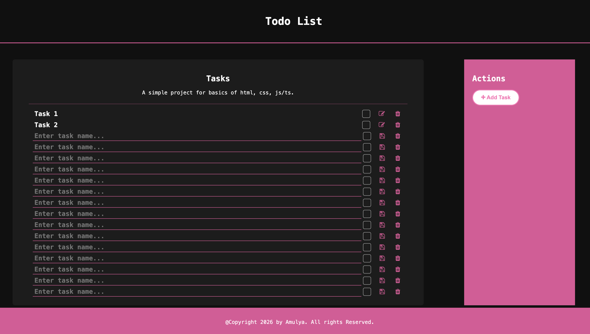

# TodoApp

A simple, basics-worthy Todo app built with HTML, CSS, and TypeScript.

It is a small project to practice core frontend skills like DOM updates, user interaction, and clean layout structuring.

## Quick Start

1. Install dependencies:
    `npm install`
2. Compile TypeScript:
    `npx tsc`
3. Open `index.html` in your browser.

## Screenshots

### Main

### Multiple Todos (Scroll)

### Extended Sidebar

To extend sidebar space, edit the sidebar height section in `style.css`.
